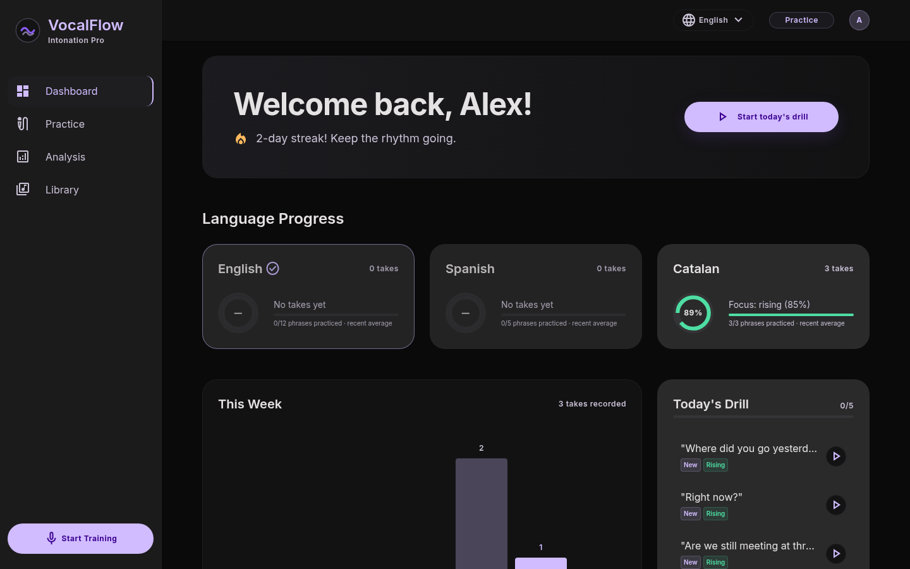
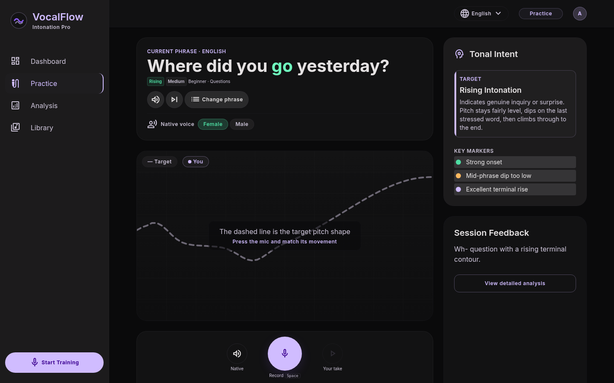
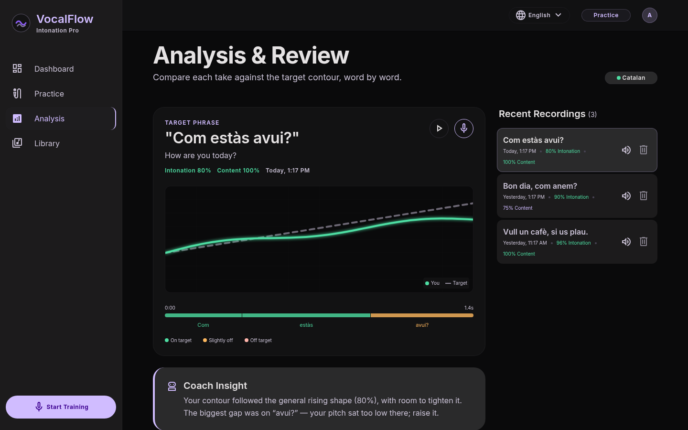
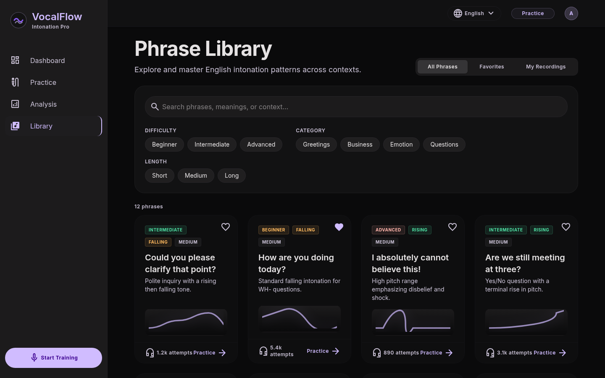
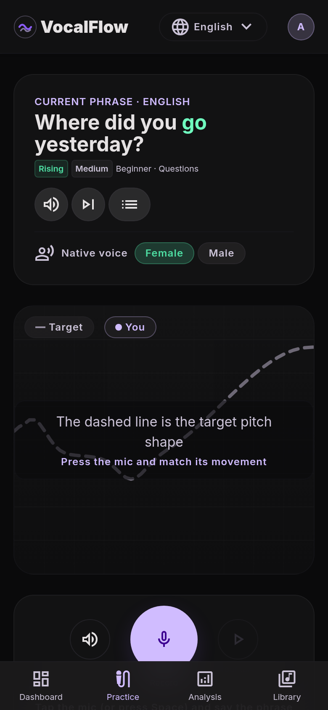

# VocalFlow — Polyglot Intonation Trainer

A standalone Vue 3 app that implements the **Polyglot Intonation Trainer** project designed in Stitch (project `16601267202136785875`, "Sonic Precision" design system). It helps learners match native pitch and intonation patterns across languages.

## Features

- **Dashboard** — everything computed from your own takes: practice streak, this week's activity, and per-language progress (recent average, phrases covered, weakest intonation pattern)
- **Daily drill** — five phrases a day picked by spaced repetition (poor takes come back the same day, good ones back off 3 → 6 → 12… days) and weighted toward your weakest pattern; each pick says why it was chosen, and Practice shows drill progress with "Next in drill"
- **Practice** — speak a phrase and get a live pitch-curve overlay against the native target, a live pitch (F0) readout in Hz and note name, and a match score. Your take is captured via `MediaRecorder` and can be **replayed** (and replayed later from the Analysis screen) with the play button.
  Press **Space** to start/stop recording; **Esc** closes the phrase picker.
- **Analysis** — your stored contour overlaid on the target, a per-word heatmap showing where you drifted (and in which direction), coach feedback, and a recording history you can replay or delete
- **Library** — searchable/filterable phrase catalog with waveform thumbnails, favorites, and a "My Recordings" tab with your best score per phrase

Language, favorites, AI-suggested phrases and recording history (scores and contours, not audio) persist in `localStorage`.

## Showcase

| Dashboard | Practice |
| --- | --- |
|  |  |
| **Analysis** | **Library** |
|  |  |

<p align="center"></p>

## Voice processing (in-browser, Chrome)

All voice processing is delegated to built-in browser APIs — no backend, no API keys:

- **Transcription** — [Web Speech API](https://developer.mozilla.org/en-US/docs/Web/API/SpeechRecognition) (`webkitSpeechRecognition`), tuned per language (`en-US`, `es-ES`, `ca-ES`).
- **Pitch tracking** — [Web Audio API](https://developer.mozilla.org/en-US/docs/Web/API/Web_Audio_API) (`getUserMedia` + `AnalyserNode`) with autocorrelation-based fundamental-frequency detection (`src/composables/usePitchDetection.js`). Scoring lives in `src/utils/intonation.js`: voiced frames are median-filtered, converted to semitones relative to the speaker's own median pitch, and centred on the target curve, so the score reflects the *shape* of the contour (rising/falling/neutral) rather than how high or low your voice is.
- **Audio capture** — the same mic stream is recorded with `MediaRecorder` (`audio/webm;codecs=opus`) while you speak, producing a replayable blob URL for the "play your recording" control.
- **Native audio preview** — browser `speechSynthesis` TTS plays the target phrase.

Requires Chrome and a working microphone (HTTPS or `localhost`).

## Getting started

```bash
pnpm install
pnpm dev        # http://localhost:5173
pnpm build      # production build to dist/
pnpm preview    # preview the production build
```

## Structure

```
src/
├── audio/                 # autocorrelation pitch detector, worker, noise-reducer worklet
├── composables/           # useSpeechRecognition, usePitchDetection
├── components/            # SideNav, TopBar, ProgressRing, PitchCurve
├── data/phrases.js        # phrases, languages, patterns, fixtures
├── utils/                 # intonation scoring, TTS/language tags, UI helpers, local AI
├── views/                 # Dashboard, Practice, Analysis, Library (lazy-loaded)
├── store.js               # shared reactive state, persisted to localStorage
├── style.css              # Sonic Precision design tokens (Tailwind v4 @theme)
└── main.js
```

## Design

The "Sonic Precision" theme: deep-charcoal surfaces, electric-violet primary, emerald success / amber warning accents, glassmorphic panels (`backdrop-filter: blur(20px)`), and the Inter typeface. Tokens live in `src/style.css` via Tailwind CSS v4 `@theme`.
